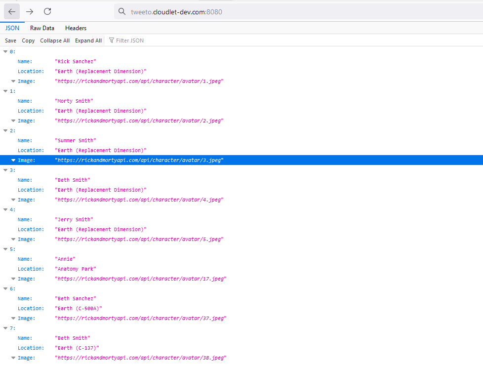
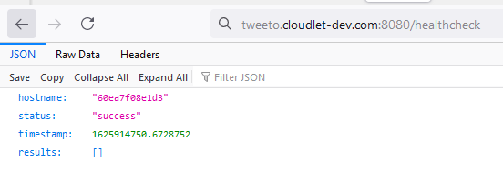

# Rick and Morty exercise

> **Note:** Before you start working with the content of this repo, make sure to login to the relevant registry and cluster.

## Prerequisites
- Bins:
  - helm
  - make
  - kubectl
  - docker
  - python3

- Python modules:
  - tablib==3.0.0
  - requests==2.20.0
  - Flask==2.0.1
  - py_healthcheck==1.10.1

- Images:
	- python:3.8-alpine
	
- User authorized with permissions to create a namespace and manage it.

---

### Files structure
  
| **File Name** | **description** |
| --- | --- |
| Dockerfile | Original docker file, used when building in an open environment |
| Makefile | containing a set of directives used by the &#39;make&#39; tool to help build and manage the project automatically |
| requirements.txt | List of the required python modules, used when building the image |
| code/ | the directory which contain all the scripts |
| code/app.py | python flask app listening on 0.0.0.0:8080 |
| code/gen_csv.py | the original script which saves the original data from rick-and-mrty-api inside a csv file |
| code/version.sh | shell script to generate version id (used when building/pushing) |
| yamls/ | the directory which contain all the basic yaml manifest files used to deploy the app |
| Helm/ | the directory which contain all the necesery helm structure files |

### Make commands
  
| **Command** | **description** |
| --- | --- |
| build | build the image from the dockerfile |
| push | Push the docker image, update helm values and debug the charts |
| run | Run docker image in a container |
| rm | Stop and remove container |
| deploy | Deploy using helm install command in the configured Kubernetes cluster in ~/.kube/config |
| debug | Deploy yamls generated from helm debug in the configured Kubernetes cluster in ~/.kube/config |
| undeploy | Undeploy in the configured Kubernetes cluster in ~/.kube/config |

### Make vars that can be used on the go

| **Vars** | **description** | **default** |
| --- | --- | --- |
| IMG_REGISTRY | image registry | `quay.io` |
| IMG_REPO | image repo | `arieltw1` |
| IMG_NAME | image name | `exercise` |
| IMG_TAG | image tag | generated with `code/version.sh` |
| VALUES_FILE | helm values file | `Helm/values.yaml` |
| NAMESPACE | target namespace | `rick-and-morty` |

## Quickstart

To build and push our image to a registry:

`$ make build push` 

All the variables are set inside the **Makefile** however, most of them can be set on the go.
You can overwrite what is set in the **Makefile**, for example- setting IMG\_TAG parameter like so:

`$ make build push IMG_TAG=v0.0.1`

---

In order to run our image localy for the first time we can run:

`$ make build push run`

When we want to rerun the container using a new image, we may run:

`$ make build push rm run`

We can also rerun the container without building and pushing the image again by using:

`$ make rm run IMG_TAG=1.10072021-d2b5e26`

---
Normal manifests deploy to a cluster (not cool):

`$ kubectl create namespace rick-and-morty`

`$ kubectl apply -f yamls/`

---
A better option would be to install our helm chart on the cluster, and that can be achived by running:

`$ helm install Helm/ --generate-name`
or
`$ make deploy`

But if we want to get more fancy we can build, push and deploy our app with only running:

`$ make build push deploy`

If you would like to check the manifests that get generated by helm and go over them you can check the **Helm/debug.yaml** file.
You may also want to deploy that debug file, so you can use:

`$ make debug`

---

## How to access the data

The app may be used in multiple scenarios:

- as a script:
  - run `$ python3 code/gen_csv.py` 
  - the script will generate a **results.csv** file with the relevenat data
  - it can be viewed with: `$ column -s, -t < results.csv  | head` as a table
- as a container:
  - run `$ make run`
  - access the data with an http GET request to **http://hostname:8080/**
  - you may access ***/healthcheck*** 
- as a kubernetes app:
  - run `$ make deploy`
  - access the **ingress** route on port **80**
  - you may access ***/healthcheck*** aswell 

-----

## screenshots
### '/'

### '/healthcheck'

